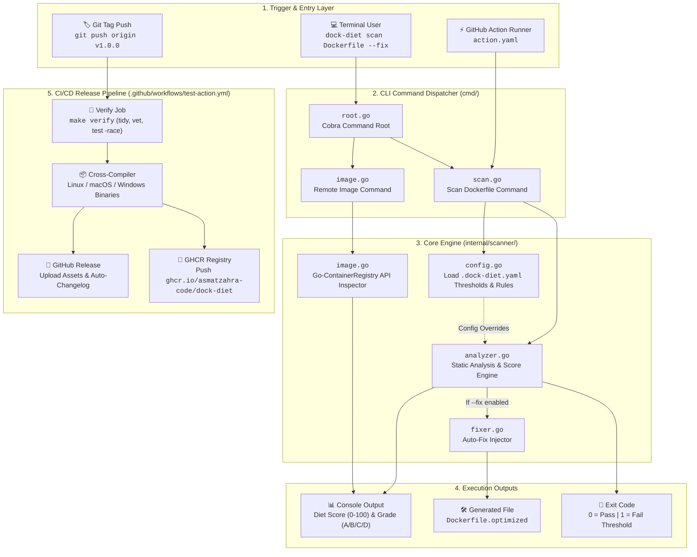

# 🥗 Dock-Diet


**Dock-Diet** is a blazingly fast, lightweight CLI tool built in Go. It acts as a fitness coach for your Dockerfiles and container images, helping you reduce size bloat, enforce security best practices, and consolidate layers.

Whether you are running it locally on your machine or inside a CI/CD pipeline, Dock-Diet ensures your containers stay lean and secure.

---

## 📑 Table of Contents

- [🚀 Key Features](#-key-features)
- [🏛️ System Architecture](#%EF%B8%8F-system-architecture)
- [🛠️ Installation](#%EF%B8%8F-installation)
- [💻 Local CLI Usage](#-local-cli-usage)
- [⚙️ CI/CD Configuration](#%EF%B8%8F-cicd-configuration)
- [🤖 GitHub Action Integration](#-github-action-integration)
- [🔄 Release Pipeline](#-release-pipeline)
- [📄 License](#-license)

---

## 🚀 Key Features

- 🔍 **Advanced Dockerfile Scanning:** Catches bad practices like missing multi-stage builds, running as root, and leftover `apt-get` caches.
- 🛠️ **Auto-Healer (`--fix`):** Safely auto-corrects minor issues and generates a clean `Dockerfile.optimized`.
- ☁️ **Remote Image Scanning:** Analyzes image sizes and layer counts directly from Docker Hub **without** having to `docker pull` them.
- 📊 **The "Diet Score":** A gamified grading system (A to D) that evaluates your container's health based on standards.
- 🤖 **CI/CD & Pipeline Ready:** Supports structured JSON output and customizable pass/fail score thresholds.

---

## 🏛️ System Architecture

The following diagram illustrates how the CLI, Core Analyzer, Auto-Fixer, and Release Automation interact:



> 📖 For sequence diagrams and deeper architectural details, check out the [Architecture Documentation](docs/architecture/ARCHITECTURE.md).

---

## 🛠️ Installation

### Option 1: 1-Line Installer Script (Recommended - No Go required)

Install `dock-diet` globally on Linux or macOS with a single command:

```bash
curl -fsSL https://raw.githubusercontent.com/AsmatZahra-code/dock-diet/main/install.sh | bash
```

*(This automatically detects your OS/Architecture, downloads the latest binary, renames it to `dock-diet`, and moves it to `/usr/local/bin` so you can use `dock-diet` globally without `./`).*

---

### Option 2: Go Install (For Go Developers)

If you already have Go installed:

```bash
go install github.com/AsmatZahra-code/dock-diet@latest
```

*(Ensure `~/go/bin` is in your system's `PATH`).*

---

### Option 3: Manual Release Download

Download pre-compiled binaries directly from the [GitHub Releases Page](https://github.com/AsmatZahra-code/dock-diet/releases):

```bash
# Example for Linux amd64
curl -Lo dock-diet https://github.com/AsmatZahra-code/dock-diet/releases/download/v1.1.2/dock-diet-linux-amd64
chmod +x dock-diet
sudo mv dock-diet /usr/local/bin/
```

---

## 💻 Local CLI Usage

Dock-Diet provides easy-to-use commands for local development:

```bash
# 1. Scan a local Dockerfile
dock-diet scan Dockerfile

# 2. Auto-fix safe optimization issues
dock-diet scan Dockerfile --fix

# 3. Scan a remote Docker image (No Docker Daemon required!)
dock-diet image alpine:latest
dock-diet image ubuntu:latest

# 4. Generate JSON output (For scripting or jq processing)
dock-diet scan Dockerfile --output json
```

---

## ⚙️ CI/CD Configuration

You can customize Dock-Diet's behavior in your pipelines by creating a `.dock-diet.yaml` file in the root of your project:

```yaml
# .dock-diet.yaml
fail_under: 80     # Pipeline fails if the Diet Score is below 80
```

---

## 🤖 GitHub Action Integration

Dock-Diet is designed to work natively as a GitHub Action. You can integrate it directly into your workflow to block unoptimized Dockerfiles:

```yaml
# .github/workflows/ci.yml
name: Docker Optimization Check
on: [push, pull_request]

jobs:
  dock-diet-scan:
    runs-on: ubuntu-latest
    steps:
      - name: Checkout Code
        uses: actions/checkout@v4
        
      - name: Run Dock-Diet Scanner
        uses: AsmatZahra-code/dock-diet@main
        with:
          dockerfile_path: 'Dockerfile'
```

---

## 🔄 Release Pipeline

Releasing new versions is fully automated via GitHub Actions:

```bash
# Create a version tag and push it
git tag v1.1.2
git push origin v1.1.2
```

This triggers the GitHub Workflow to automatically:
1. Run full verification tests with race detection (`make verify`).
2. Cross-compile native binaries for Linux (`amd64`, `arm64`), macOS (`amd64`, `arm64`), and Windows (`amd64.exe`).
3. Publish a GitHub Release with an auto-generated changelog.
4. Build and push a container image to `ghcr.io/asmatzahra-code/dock-diet`.

---

## 📄 License

Built with ❤️ by Asmat Zahra. Distributed under the MIT License.
