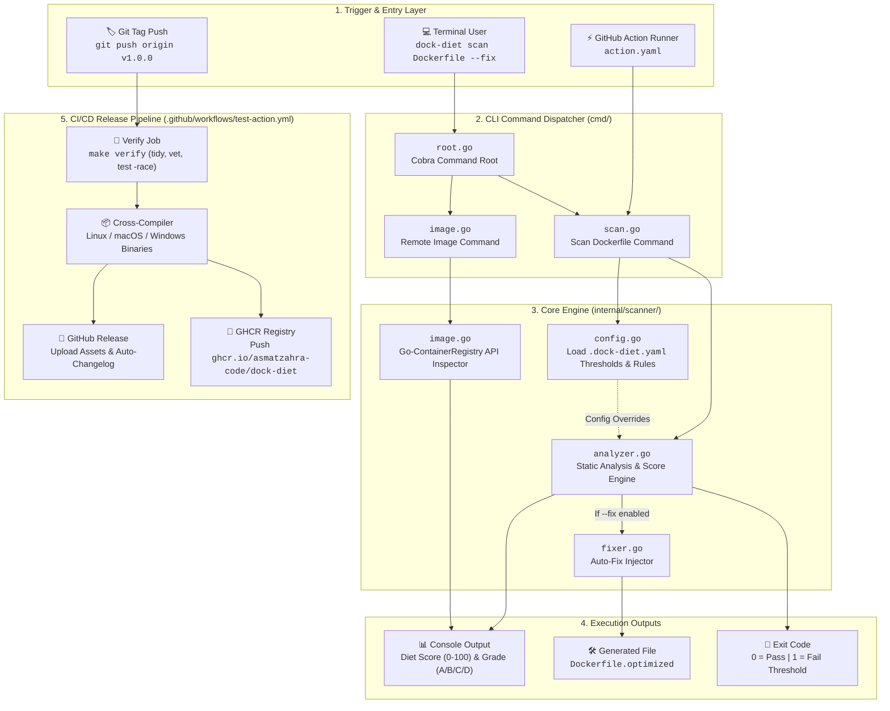
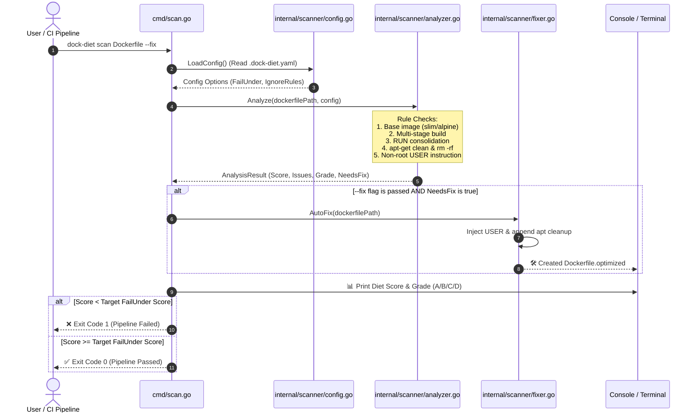
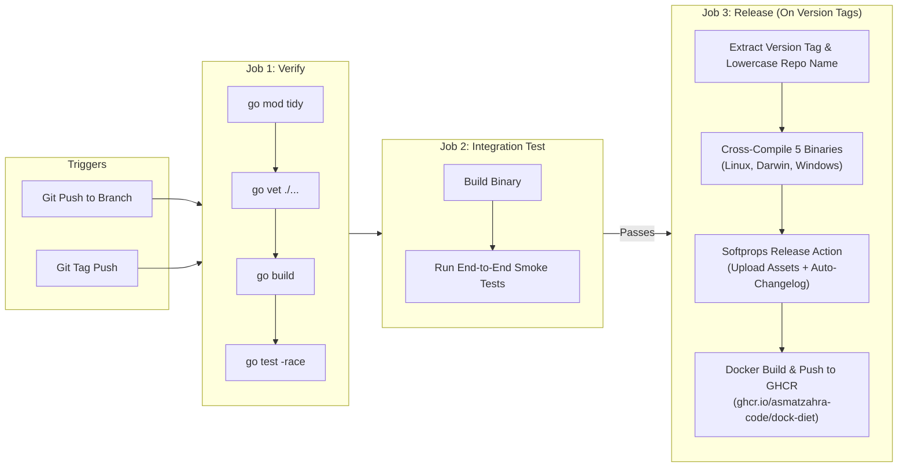

# 🏛️ Dock-Diet Architecture & System Design

This document details the architecture, component flow, and release pipeline of **Dock-Diet**.

> 📖 For key technical choices and design rationale, see [Architectural Decision Records (ADRs)](ADR.md).

---

## 1. High-Level System Architecture

---

## 2. Dockerfile Scanner & Scoring Workflow

---

## 3. CI/CD Release Automation Flow

